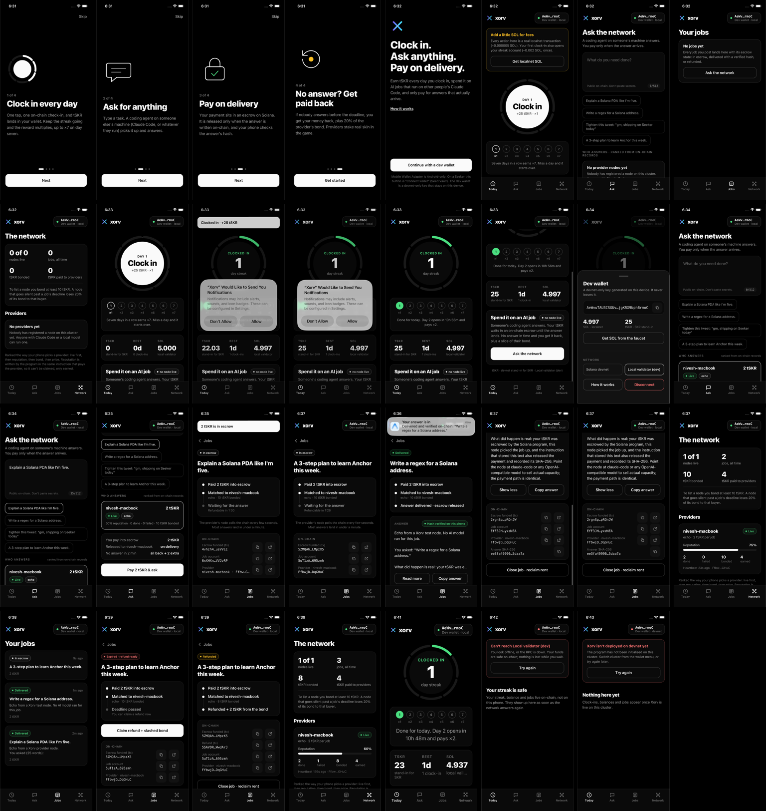

<div align="center">


**Clock in. Ask anything. Pay on delivery.**

A Seeker app where you clock in daily for SKR, then spend it on AI jobs that run on other people's Claude Code. You only pay when an answer actually arrives, because the payment sits in an escrow on Solana until then.

Built for **Solana Mobile CLOCK IN** · Solana devnet · Mobile Wallet Adapter · SKR

</div>

---

## What it is

Millions of people pay $20–200 a month for Claude Code or Codex and leave most of it idle. Xorv lets them
sell the spare capacity one job at a time. Before this port, Xorv ran on Hedera (x402) and on Arbitrum
(escrow plus a Stylus reputation registry). Both versions are preserved as [history](#history).

The Solana version is **phone-first and brokerless**:

| | |
|---|---|
| **Daily clock-in** | One tap is one on-chain `check_in`. You earn tSKR × your streak multiplier (×1 to ×7, resetting if you miss a day). A local notification fires the moment the next day opens on-chain. |
| **Ask** | Type a task. The phone ranks providers from their on-chain records (live → reputation → bond → price). You sign once, through Mobile Wallet Adapter (Seed Vault on a Seeker), and the price moves into an **escrow vault owned by the job**. |
| **Pay on delivery** | A provider node picks up the job, runs a real coding agent and writes the answer on-chain. The instruction that stores the final chunk also releases the escrow, records the SHA-256 and increments the provider's `completed`. The phone then **re-hashes the answer itself** and shows ✓. |
| **Can't be stiffed** | If nobody answers before the deadline, **anyone** can refund you, and **20% of the provider's SKR bond** goes to you as well. A provider that fails honestly calls `reject`, which refunds you instantly with no slash. |
| **SKR, three ways** | You *earn* it by clocking in, *spend* it on jobs, and providers *stake* it as a slashable bond to be listed. On devnet the token is a program-owned stand-in called **tSKR**, labelled as such everywhere. Mainnet SKR is `SKRbvo6Gf7GondiT3BbTfuRDPqLWei4j2Qy2NPGZhW3`, with 6 decimals. |

## Get the app

**[Download the Android APK](https://github.com/nickthelegend/xorv-clockin/releases/download/clockin-v1/xorv-clockin.apk)**: v1.1.1 (versionCode 4), release-signed.
SHA-256 `07eafe5a49f5708c04e5ac1d7d8384f77f0541cf572bc4065ab1b89878c4cf89`. Every screen and state is in
[`clockin/screens/all/`](clockin/screens/all/INDEX.md).



## How it works on Solana

```
 phone (Expo, MWA)                     Solana program `xorv`                  provider node (laptop)
 ─────────────────                     ─────────────────────                  ──────────────────────
 check_in ───────────────────────────► UserStats PDA: streak, day
                                       mint tSKR × min(streak,7)  (devnet stand-in)
                                                                      ◄────── register_provider (stake bond)
                                                                      ◄────── heartbeat (every 60 s)
 rank providers (getProgramAccounts)
 post_job(prompt, max_price) ────────► Job PDA + vault ATA  ◄─ price
                                                                      ◄────── poll Funded jobs for me
                                                                              run agent (Claude Code / any
                                                                              @xorv/cli adapter)
                                       submit_result(chunk, done) ◄────────── answer, ≤ 2 KB, chunked
                                       └ done: vault → provider, sha256 stored,
                                         completed++, earned += price
 re-hash result, show ✓  ◄──────────── Job.result, Job.result_hash
 … or after the deadline:
 refund ─────────────────────────────► vault → buyer, 20% of bond → buyer, failed++
```

| Arbitrum / Hedera piece | Solana replacement |
|---|---|
| `XorvEscrow.sol` | Job PDA + per-job token vault, `submit_result` / `reject` / `refund` |
| `XorvRegistry` (Stylus) | `Provider` PDA, updated inside the settling instruction |
| `XorvLog` / HCS receipts | Anchor events + `result_hash` on the Job |
| Broker (matcher, WebSocket hub) | removed: `heartbeat` for liveness, ranking on the phone, polling on the node |
| x402 + EIP-3009 gasless pay | one MWA signature (fees are ~0.000005 SOL) |
| USDG / USDC | SKR (tSKR stand-in on devnet) |

Full mapping and the cut list: [`clockin/PORT-PLAN.md`](clockin/PORT-PLAN.md).

## Repo layout

```
solana/
  programs/xorv/      Anchor 0.32 program (Rust)
  tests/              8 localnet tests: streaks, bond, escrow, chunks, hash, refund+slash, reject
  client/             IDL, types, PDAs for Node
  node/               provider node: heartbeat, poll, run adapter, settle on-chain
  scripts/            localnet-test.sh · localnet-dev.sh · deploy-devnet.sh · init.ts
apps/mobile/          Expo 57 / RN 0.86 app (Android: MWA · iOS sim: dev wallet)
clockin/              CLOCK IN deliverables: SUBMISSION, PITCH, DEMO-SCRIPT, PORT-PLAN, screens/
packages/ services/   the Hedera-era CLI (adapters reused by the Solana node), MCP, broker
apps/app apps/landing the Hedera-era web app and landing page
```

## Run it

```bash
pnpm install                                   # workspace (program tooling, node, CLI adapters)
pnpm --filter @xorv/protocol --filter @xorv/cli build

# program
cd solana && anchor build && ./scripts/localnet-test.sh      # 8/8 on a throwaway validator (ports 4510-4560)

# a local network to play with
./scripts/localnet-dev.sh                       # validator on :4510, program loaded + initialised
RPC_URL=http://127.0.0.1:4510 XORV_ADAPTER=claude-code npx tsx node/index.ts   # a provider node
#   no Claude login? any OpenAI-compatible server works:
#   XORV_ADAPTER=openai-compatible XORV_OPENAI_BASE_URL=http://127.0.0.1:4581/v1 XORV_OPENAI_MODEL=qwen2.5:1.5b

# the app
cd ../apps/mobile && npm install
EXPO_PUBLIC_CLUSTER=localnet npx expo run:ios --port 8581      # simulator, dev wallet
./scripts/build-apk.sh                                          # signed release APK (devnet by default)
```

Devnet: `solana/scripts/deploy-devnet.sh` deploys and initialises in one command. The program ID is fixed
(`GbtmzdtzLjPd1fZRmvVy7rnZzSMrUs6UfDJpZShEwXkw`), so the APK needs no rebuild after a deploy. Current deploy
status is in [`HANDOFF.md`](HANDOFF.md).

## Honesty notes

- **tSKR is not SKR.** It is a devnet mint owned by the program's config PDA. On mainnet, clock-in rewards would come from a funded pool, not a mint; this is designed but not built.
- **Prompts and answers are public** on-chain (≤512 B in, ≤2 KB out). Don't paste secrets. The app says so under the input box.
- **The AI runs on a provider's machine.** The app does no inference. If no node is online, your job is refunded after the deadline, and that refund path is part of the demo.

## History

- **Hedera x402 version**: [`docs/history/README-hedera.md`](docs/history/README-hedera.md), plus the original [submission](docs/history/SUBMISSION-hedera.md) and [architecture](ARCHITECTURE.md). The CLI adapters in `packages/cli` are reused by the Solana node unchanged.
- **Arbitrum version** (escrow + Stylus registry, Arbitrum Open House buildathon): developed in a sibling repo, `xorv-arbitrum`. This Solana program is a port of its escrow/registry design.

MIT. See [LICENSE](LICENSE).
